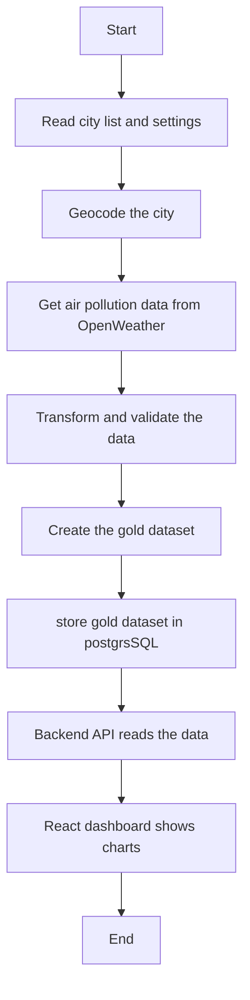

# Planned Runtime Flow

## Purpose

This document specifies the planned runtime flow for the City Air Tracker pipeline. The pipeline collects air pollution data, transforms it, stores the processed data, and creates the dashboard display.

## Runtime Flow

## Step 1 - Read Configuration

The pipeline starts by loading the the city configuration and runtime setting defined in the project input contract.

It reads:

- the city list
- City configuration
- runtime settings

If something is missing, the pipeline should stop and show an error.

## Step 2 - Extract

The pipeline gets retrives air pollution data from the openWeather Air pollution API.

First, it finds the city's latitude and longitude.

Then it downloads the historical air pollution data.

The raw data remains in memory and is passed to the transformation step.

## Step 3 - Transform

The raw data is cleaned before it is used.

The pipeline:

- removes duplicate data
- fixes timestamps
- checks for missing information
- - converts the data into the format required for the PostgreSQL database and dashboard

## Step 4 - Load

After the data is cleaned and transformed, the gold dataset is written to PostgreSQL.

The backend API reads the gold dataset from PostgreSQL, and the React dashboard displays the processed air quality data.

## Logging

The pipeline should write logs when:

- it starts
- it connects to the API
- it saves data
- it finishes
- an error happens

These logs help developers find problems.

## Error Handling

If something goes wrong, the pipeline should:

- write an error message to the log
- stop if the problem is serious
- retry if the API is temporarily unavailable
- avoid saving incomplete data

