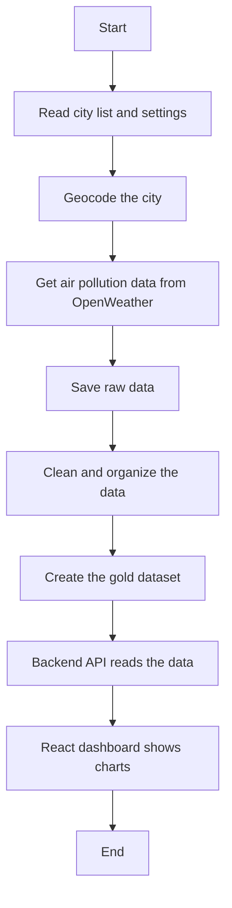

# Planned Runtime Flow

## Purpose

This document explains how the City Air Tracker pipeline works from start to finish. As I understand it, the pipeline collects air pollution data, prepares it, saves it, and makes it ready for the dashboard.

## Runtime Flow

## Step 1 - Read Configuration

The pipeline starts by reading the settings.

It reads:

- the city list
- the API key
- the database connection

If something is missing, the pipeline should stop and show an error.

## Step 2 - Extract

The pipeline gets information from OpenWeather.

First, it finds the city's latitude and longitude.

Then it downloads the historical air pollution data.

The raw data is saved in the database.

## Step 3 - Transform

The raw data is cleaned before it is used.

The pipeline:

- removes duplicate data
- fixes timestamps
- checks for missing information
- prepares the data for the dashboard

## Step 4 - Load

After the data is cleaned, it is saved as the **gold dataset**.

The gold dataset is the final version that the dashboard uses.

## Logging

The pipeline should write logs when:

- it starts
- it connects to the API
- it saves data
- it finishes
- an error happens

These logs help developers find problems.

## Error Handling

If something goes wrong, the pipeline should:

- write an error message to the log
- stop if the problem is serious
- retry if the API is temporarily unavailable
- avoid saving incomplete data

## Why This Pipeline Is Important

The pipeline prepares the data before the dashboard needs it.

Because of this:

- the dashboard loads faster
- the data is cleaner
- the system is easier to maintain
- users do not have to wait for live API calls every time they open the dashboard